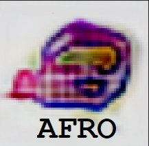
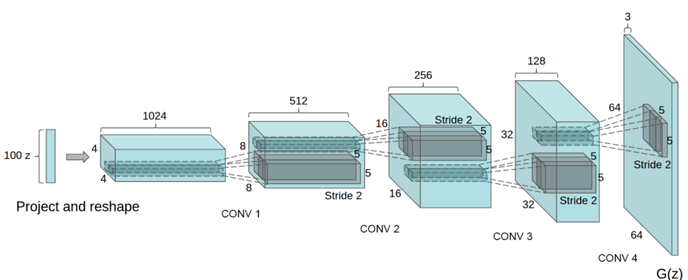
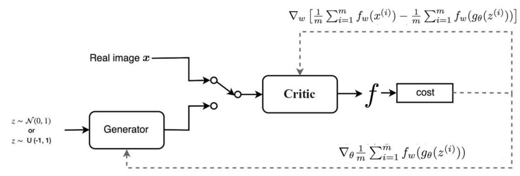
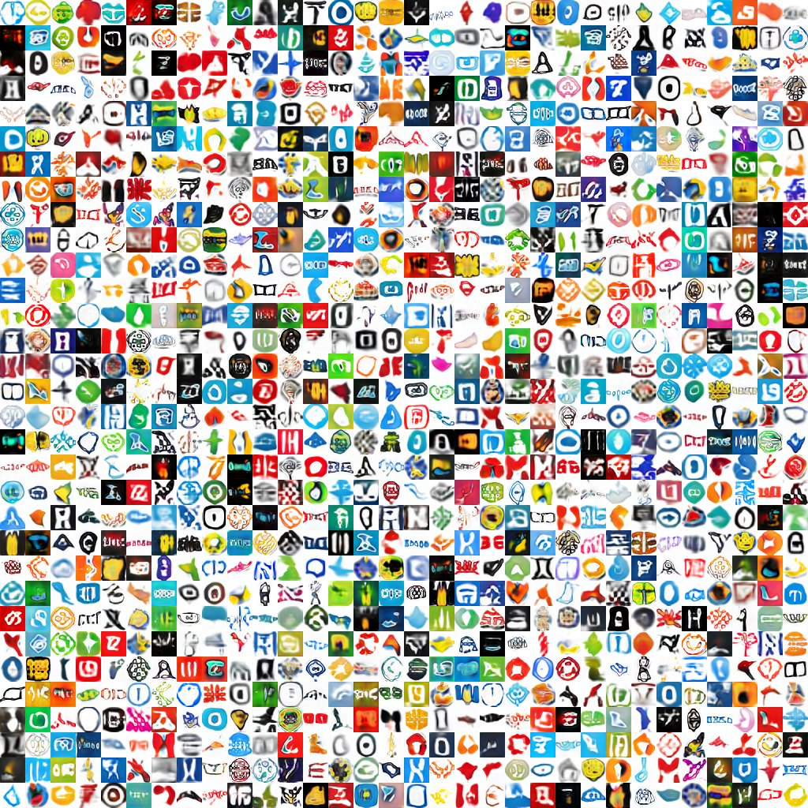

# AFRO project (Automotive, Fast, Responsible, Opensource)

  

## Objective

Imagine yourself in the place of a startup. A lot of things to do, deadlines of the project are burning, and besides, money is tight. There is no company name. There is no logo. There is an approximate image of words in your head. What can you do?
1. Go to the Studio of Artemy Lebedev, and get a logo for 100k RUB (expensive and time-spending);
2. Find freelancers and get a logo for 5k RUB (cheap and long);
3. Contact AFRO (free and fast);

Naturally, every startup will choose the third point and contact us!
Our dignity:
1. Quickly;
2. Many of the proposed solutions;
3. Your logo will be the most innovative at the Tech-Crunch!

Provide yourself with an Automotive, Fast, Responsible, Opensource employee who will provide you with several creations to choose your logo based on a simple set of words.

## How it works

This telegram bot allows you to generate a logo for you from a certain set of keywords. It works on a generative neural network - iWGAN-GP (improved Wasserstein Generative Adversarial Network with Gradient Penalty). GAN consists of a generator and discriminator. The generator tries to create an image that will be accepted by the discriminator. At the same time, discriminator tries to decline generated images, which do not look real. WGAN is the modified GAN, which upgraded with gradient penalty, hinges on the 1-Lipschitz continuity of the discriminator using spectral normalization.

### Architecture

<em>GAN typical architecture. Here is DCGAN (Deep Convolutional GAN).</em>

<em>iWGAN-GP working scheme</em>

[Source](https://medium.com/@jonathan_hui/gan-wasserstein-gan-wgan-gp-6a1a2aa1b490) of architecture images.

## Quickstart

1. Write to our [bot](https://t.me/LogoAfroBot);
2. Press `start`;
3. Type characteristic words for your logo;
4. Get the result.

## Requirements
### Specification of dependencies

- [OpenCV](https://opencv.org/) (An open source computer vision and machine learning software library)
- [TensorFlow](https://opencv.org/) (An end-to-end open source machine learning platform)
- [PyTorch](https://pytorch.org/) (An open source machine learning framework that accelerates the path from research prototyping to production deployment)
- [ISR](https://github.com/idealo/image-super-resolution) (An open source image super-resolution library)

If for some reason you choose not to use Anaconda, you must install the following frameworks and packages on your system:
* Python 3.8
* opencv 4.4.0
* numpy 1.18.5
* albumentations 0.4.6
* matplotlib 3.3.2
* h5py 2.10.0
* tensorflow 2.0.0
* Keras 2.4.3
* ISR 2.2.0
* torch 1.4.0
* nltk 3.5
* tqdm 4.41.1
* PIL 6.2.1

### Data
The source of images can be found [here](https://data.vision.ee.ethz.ch/sagea/lld/data/).

## Examples of work

iWGAN-GP output:

  
  

StyleGAN2 output:

## Team

* [Aleksandr Frolov](https://github.com/AllexFrolov)
* [Kirill Burovin](https://github.com/Kupchanski)
* [Rodion Bukhanevich](https://github.com/RodionBukhanevych11)
* [Bogdan Tyshchenko](https://github.com/deepwebhoax)
* [Aleksandr Isakov](https://github.com/asisakov)

## Acknowledgements

* [Andrei Spiridonov](https://github.com/poxyu)
* [Open Data Science](https://ods.ai/) (An international community of Data Science specialists, researchers, and engineers)
