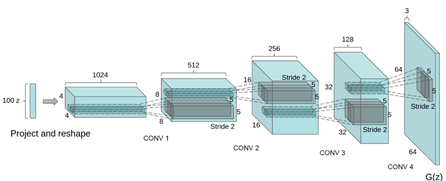

# AFRO project

## Objective

Imagine yourself in the place of a startup. A lot of things to do, deadlines are burning, and besides, money is tight. And there is a company name. But there is no logo. There is an approximate image of words in your head. What can I do?
1. Go to the Studio of Artemy Lebedev, and get a logo for 100k RUB (expensive and long);
2. Find freelancers and get a logo for 5k RUB (cheap and long);
3. Contact AFRO (free and fast);

Naturally, every startup will choose the third point and contact us!
Our dignity:
1. Quickly;
2. Many of the proposed solutions;
3. Your logo will be the most innovative at the Tech-crunch!

## How it works

This telegram bot allows you to generate a logo for you from a certain set of keywords. This works on generative neural network - DCGAN (Deep Convolutional Generative Adversarial Network). GAN consists of generator and discriminator. Generator tries to create image that will be accepted by discriminator. On the same time discriminator tries to decline generated images, which are not looks like real. DCGAN is the modified GAN, where all max-pooling replaced with convolutional stride and transposed convolution is used for upsampling.

### Architecture

<em>Sample caption</em>

## Quickstart

## Requirements
### Specification of dependencies
- [OpenCV](https://opencv.org/) (An open source computer vision and machine learning software library)
- [TensorFlow](https://opencv.org/) (An end-to-end open source machine learning platform)
- [ISR](https://github.com/idealo/image-super-resolution) (An open source image super-resolution library)

If for some reason you choose not to use Anaconda, you must install the following frameworks and packages on your system:
* Python 3.8
* opencv 4.4.0
* numpy 1.18.5
* albumentations 0.4.6
* matplotlib 3.3.2
* h5py 2.10.0
* tensorflow 2.0.0
* Keras 2.4.3
* ISR 2.2.0

### Data
The source of an images can be found [here](https://data.vision.ee.ethz.ch/sagea/lld/data/).

## Team

* Aleksandr FROlov
* Kirill BURovin
* Rodion BUKhanevich
* Bogdan TYShchenko
* Aleksandr ISAkov

## Acknowledgements

* Andrei Spiridonov
* [Open Data Science](ods.ai)
